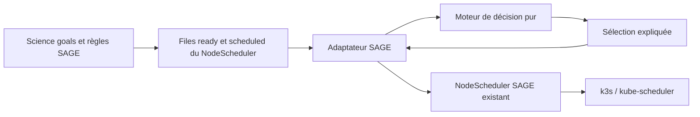

# Architecture du MVP

[English version](architecture.md)

## Objectif

Le projet ajoute une politique d’urgence et de résilience au-dessus des mécanismes déjà présents dans SAGE/Waggle. Il ne recrée ni un orchestrateur, ni un scheduler Kubernetes, ni le cycle de vie des plugins.

La séparation principale est la suivante :

- SAGE décide quand une règle scientifique rend une application prête.
- Le moteur de ce dépôt classe et admet les applications prêtes.
- Le `NodeScheduler` SAGE transforme les applications sélectionnées en Pods.
- Le scheduler Kubernetes choisit leur placement final.



Le dépôt ne déploie et ne contacte aucun de ces services automatiquement.

## Composants

### Moteur indépendant

`pkg/policy` ne dépend ni de SAGE, ni de Kubernetes. Il reçoit :

- l’heure de la décision ;
- les tâches prêtes ;
- les tâches déjà actives ;
- éventuellement la capacité disponible ;
- une configuration validée.

Il renvoie les tâches sélectionnées et une décision pour chaque candidate : `selected`, `deferred` ou `rejected`, avec une raison stable.

Cette isolation permet de tester et de rejouer une politique sans cluster.

### Outil de replay

`cmd/policyctl` charge la même configuration que l’intégration SAGE et lit un instantané JSON. Il sert à :

- valider une configuration ;
- comparer des politiques sur les mêmes entrées ;
- produire une trace de décision ;
- préparer des campagnes de chaos reproductibles.

Il ne possède aucun client réseau.

### Laboratoire de sensibilité

`cmd/chaoslab` applique hors ligne de petites perturbations décrites dans un scénario, recalcule les décisions et compare les ensembles sélectionnés avec leur distance de Jaccard. Une distance de 0 signifie que la sélection est inchangée ; une distance de 1 signifie que les deux sélections sont disjointes. Il étudie donc la sensibilité de la politique ; il n’injecte pas de panne dans Kubernetes.

KWOK jouera un rôle différent lors de la validation intégrée : simuler des nœuds, des Pods et des transitions de panne à grande échelle.

### Adaptateur SAGE

`integrations/sage/adapter` implémente l’interface compilée :

```go
SelectBestPlugins(
    readyQueue *datatype.Queue,
    scheduledQueue *datatype.Queue,
    available datatype.Resource,
) ([]*datatype.PluginRuntime, error)
```

L’adaptateur photographie les deux files, convertit chaque `PluginRuntime` en tâche du moteur, puis retourne exclusivement des pointeurs déjà présents dans la file `ready`. Il ne pousse, ne retire et ne réordonne aucun élément de la file SAGE.

La file du commit Waggle épinglé retire toutefois un runtime par
`Plugin.Name`, et non par identité complète. L’adaptateur ne sélectionne donc
jamais un homonyme tant qu’un runtime de même nom apparaît avant lui dans
`ready` ou existe dans `scheduled`. Cette sérialisation empêche une mauvaise
sélection, mais elle ne corrige pas les autres suppressions amont par nom.

La même `Queue` amont expose `Length` et `More` sans verrou et partage un
curseur d’itération mutable. Or l’API REST du `NodeScheduler` peut appeler
`Push` depuis une autre goroutine. L’adaptateur ne peut pas rendre cette
photographie atomique, car le verrou de la file n’est pas exposé. Avant un
canary, Waggle doit fournir une méthode `Snapshot` sous un verrou unique ou
faire passer toutes les soumissions par la boucle d’événements du scheduler.

### Binaire d’intégration

`integrations/sage/cmd/waggle-nodescheduler` réutilise le constructeur du `NodeScheduler` amont et remplace son champ `SchedulingPolicy` par l’adaptateur. Cette approche évite de recopier le scheduler SAGE et prépare une image de remplacement future.

Le mode `-validate-config` s’arrête avant la configuration de SAGE et constitue le seul mode prévu tant que le déploiement n’est pas confirmé. Les modes Waggle `simulate` et `noRabbitMQ` sont refusés en exécution réelle, car le commit épinglé ne les implémente pas de manière sûre.

## Politique de classement

Pour une tâche, le moteur calcule :

```text
slack = échéance - maintenant - durée_estimée
```

Sans échéance absolue, il calcule une échéance locale :

```text
échéance = arrivée_dans_la_file + latence_maximale
```

Le score total est une moyenne pondérée de quatre valeurs normalisées entre 0 et 100 :

- priorité déclarée ;
- urgence dérivée du slack ;
- âge dans la file ;
- probabilité de succès prévue.

Les poids sont configurables. À score égal, l’ordre est déterministe : échéance la plus proche, arrivée la plus ancienne, puis identifiant lexical.

Un slack négatif signale une échéance probablement impossible. Le MVP rend ce fait visible mais peut tout de même sélectionner la tâche, car il ne connaît aucune application alternative.

## Admission

Après classement, le moteur applique dans cet ordre :

1. validité de la tâche et unicité de son identifiant ;
2. seuil minimal de fiabilité ;
3. nombre maximal de tâches actives ;
4. nombre maximal de tâches GPU actives ;
5. ajustement CPU, mémoire et GPU si `enforceResourceFit` est activé.

Une tâche différée reste dans la file gérée par SAGE. Le moteur ne crée et ne supprime aucun Pod.

Les hints stockés dans `PluginSpec.Env` sont auto-déclarés par l’auteur du job
et transmis au conteneur. Ils sont ignorés par défaut. Le réglage
`trustWorkloadEnvHints` ne doit être activé que pour un pilote de confiance ou
après ajout d’une admission cloud qui autorise et borne l’urgence par tenant.

## Repli

Lorsque `failOpen` est activé et que le moteur ne peut pas produire de décision, l’adaptateur choisit les premières tâches de la file tout en respectant :

- `maxConcurrent` ;
- `maxGPUConcurrent`.

Le repli filtre les runtimes invalides et les collisions de nom, enregistre une
décision avec la raison `fail_open_fallback`, puis nettoie l’état expiré.

Ce repli signifie « continuer avec une sélection minimale ». Ce n’est pas :

- une application de secours ;
- un retry ;
- un checkpoint ;
- une restauration après panne.

Des hints invalides sont rejetés ; ils ne déclenchent pas automatiquement le repli.

## État local

SAGE n’expose pas l’heure d’entrée dans sa file. L’adaptateur mémorise donc la première observation de chaque tâche en mémoire, avec une rétention par défaut de 24 heures.

Conséquences :

- l’ancienneté repart de zéro au redémarrage du processus ;
- deux instances du scheduler ne partagent pas cet état ;
- la persistance devra être ajoutée avant de promettre une reprise résiliente.

## Cœur optionnel pour caméra additionnelle

`pkg/orchestration` s’ajoute au moteur de politique sans le modifier. Une
application peut l’utiliser pour capturer en parallèle une image principale et
une image additionnelle, les corréler avec un même identifiant, borner leur
taille et leur écart temporel, valider la position et l’état PTZ associés à la
prise de vue, puis appeler une interface générique d’analyse à deux images. Les
sessions d’un même coordinateur sont sérialisées autour des caméras physiques.

HaLow est un adaptateur possible de l’`ImageSource` additionnelle, pas une
exigence du scheduler. Les types versionnés de requête/réponse, de transfert
découpé avec intégrité et d’ACK persistant sont inclus ; les implémentations
MQTT sur HaLow, des pilotes caméra/GPS/PTZ et du modèle restent hors du cœur.
Une caméra fixe peut fournir une position arpentée et une vue calibrée au lieu
d’un GPS/PTZ matériel. Les workloads à une seule caméra et les décisions de
politique existantes ne changent pas. Voir
[`halow-orchestration.md`](halow-orchestration.md).

## Ce qui est réutilisé

- L’interface de politique et les types de [Waggle edge-scheduler](https://github.com/waggle-sensor/edge-scheduler).
- Le `NodeScheduler`, son gestionnaire de goals et son gestionnaire de Pods.
- Les quantités Kubernetes pour analyser CPU, mémoire et GPU.
- Les idées de charge moyenne, variation et risque de [Trimaran](https://github.com/kubernetes-sigs/scheduler-plugins/tree/master/pkg/trimaran), sans importer `scheduler-plugins`.
- La priorité et la préemption natives de Kubernetes comme future couche d’exécution.

Le dépôt n’importe pas `scheduler-plugins`, car son API doit correspondre exactement à la version de Kubernetes/k3s déployée.

## Limites du MVP

| Capacité | État actuel |
|---|---|
| Classement urgence/priorité | Implémenté |
| Vieillissement anti-famine | Implémenté |
| Seuil de fiabilité | Implémenté |
| Limite de concurrence | Implémenté |
| Limite de concurrence GPU | Implémenté |
| Ajustement CPU/mémoire/GPU | Implémenté, mais désactivé par défaut tant que SAGE ne fournit pas une capacité réelle |
| Explication de décision | Implémentée dans le moteur et `policyctl` |
| Coordination optionnelle de deux images | Cœur, contrat position/PTZ à la prise de vue et transfert HaLow vérifiable implémentés ; adaptateurs matériel/transport/IA à fournir |
| Préemption | Non implémentée |
| Retry et budget de reprises | Non implémentés |
| Checkpoint/reprise | Non implémentés |
| Réplication et domaines de panne | Non implémentés |
| Application de secours | Non implémentée |
| Persistance d’état | Non implémentée |
| Autorisation multi-tenant des hints | Non implémentée ; hints désactivés par défaut |
| Identité complète dans les files Waggle | Mitigation sur la sélection seulement ; correction amont requise |
| Métriques Prometheus du NodeScheduler | Non implémentées |
| Apprentissage en ligne ou LLM | Hors périmètre |

## Validation progressive proposée

1. Tests unitaires, tests de permutation et fuzzing du moteur.
2. Replay de traces avec `policyctl`.
3. Analyse de sensibilité hors ligne avec `chaoslab`.
4. Scénarios KWOK pour l’échelle et les transitions Kubernetes.
5. k3s avec vrais conteneurs et fautes réseau/ressources.
6. Exécution shadow sur un nœud SAGE, sans appliquer les décisions.
7. Correction amont des opérations de file par identité complète.
8. Correction amont du snapshot concurrent des files.
9. Canary sur quelques nœuds avec arrêt automatique.

KWOK ne mesure ni l’inférence GPU réelle, ni l’énergie, ni la température, ni les capteurs physiques. Ces propriétés exigent du matériel SAGE.
