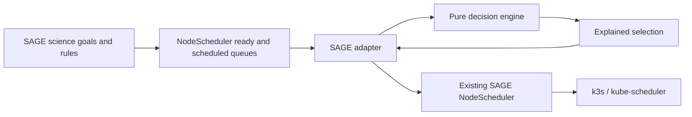

# MVP Architecture

[Version française](architecture-fr.md)

## Objective

The project adds an urgency and resilience policy on top of the mechanisms already present in SAGE/Waggle. It does not recreate an orchestrator, a Kubernetes scheduler, or the plugin lifecycle.

The main separation of responsibilities is:

- SAGE decides when a science rule makes an application ready.
- This repository's engine ranks and admits ready applications.
- The SAGE `NodeScheduler` turns selected applications into Pods.
- The Kubernetes scheduler chooses their final placement.



The repository does not automatically deploy or contact any of these services.

## Components

### Independent Engine

`pkg/policy` depends on neither SAGE nor Kubernetes. It receives:

- the decision time;
- ready tasks;
- tasks that are already active;
- optionally, the available capacity;
- a validated configuration.

It returns the selected tasks and a decision for each candidate—`selected`, `deferred`, or `rejected`—with a stable reason.

This isolation makes it possible to test and replay a policy without a cluster.

### Replay Tool

`cmd/policyctl` loads the same configuration as the SAGE integration and reads a JSON snapshot. It is used to:

- validate a configuration;
- compare policies on the same inputs;
- produce a decision trace;
- prepare reproducible chaos campaigns.

It has no network client.

### Sensitivity Lab

`cmd/chaoslab` applies small scenario-defined perturbations offline, recalculates the decisions, and compares the selected sets using their Jaccard distance. A distance of 0 means the selection is unchanged; a distance of 1 means the two selections are disjoint. It therefore studies policy sensitivity; it does not inject failures into Kubernetes.

KWOK will serve a different role during integrated validation: simulating nodes, Pods, and failure transitions at scale.

### SAGE Adapter

`integrations/sage/adapter` implements the compiled interface:

```go
SelectBestPlugins(
    readyQueue *datatype.Queue,
    scheduledQueue *datatype.Queue,
    available datatype.Resource,
) ([]*datatype.PluginRuntime, error)
```

The adapter snapshots both queues, converts each `PluginRuntime` into an engine task, and returns only pointers already present in the `ready` queue. It does not push, remove, or reorder any element in a SAGE queue.

However, the queue in the pinned Waggle commit removes a runtime by
`Plugin.Name`, not by its full identity. The adapter therefore never selects a
same-named runtime while another runtime with that name appears before it in
`ready` or exists in `scheduled`. This serialization prevents an incorrect
selection, but it does not fix other upstream removals by name.

The same upstream `Queue` exposes `Length` and `More` without locking and
shares a mutable iteration cursor. The `NodeScheduler` REST API can call
`Push` from another goroutine. The adapter cannot make this snapshot atomic
because the queue lock is not exposed. Before a canary, Waggle must provide a
`Snapshot` method protected by a single lock or route all submissions through
the scheduler's event loop.

### Integration Binary

`integrations/sage/cmd/waggle-nodescheduler` reuses the upstream `NodeScheduler` constructor and replaces its `SchedulingPolicy` field with the adapter. This avoids copying the SAGE scheduler and prepares a future replacement image.

The `-validate-config` mode exits before SAGE configuration and is the only intended mode until deployment is confirmed. The Waggle `simulate` and `noRabbitMQ` modes are rejected during actual execution because the pinned commit does not implement them safely.

## Ranking Policy

For a task, the engine calculates:

```text
slack = deadline - now - estimated_runtime
```

Without an absolute deadline, it calculates a local deadline:

```text
deadline = queue_arrival + maximum_latency
```

The total score is a weighted average of four values normalized between 0 and 100:

- declared priority;
- urgency derived from slack;
- age in the queue;
- predicted probability of success.

The weights are configurable. When scores are equal, ordering is deterministic: earliest deadline, oldest arrival, then lexical identifier.

Negative slack indicates a deadline that is likely impossible to meet. The MVP makes this visible but can still select the task because it does not know of any alternative application.

## Admission

After ranking, the engine applies the following checks in order:

1. task validity and identifier uniqueness;
2. minimum reliability threshold;
3. maximum number of active tasks;
4. maximum number of active GPU tasks;
5. CPU, memory, and GPU fit when `enforceResourceFit` is enabled.

A deferred task remains in the queue managed by SAGE. The engine neither creates nor deletes Pods.

Hints stored in `PluginSpec.Env` are self-declared by the job author and passed
to the container. They are ignored by default. `trustWorkloadEnvHints` should
be enabled only for a trusted pilot or after adding cloud admission that
authorizes and bounds urgency per tenant.

## Fallback

When `failOpen` is enabled and the engine cannot produce a decision, the adapter chooses the first tasks in queue order while respecting:

- `maxConcurrent`;
- `maxGPUConcurrent`.

The fallback filters invalid runtimes and name collisions, records a decision
with the reason `fail_open_fallback`, and then clears expired state.

This fallback means "continue with a minimal selection." It is not:

- a fallback application;
- a retry;
- a checkpoint;
- a recovery from failure.

Invalid hints are rejected; they do not automatically trigger the fallback.

## Local State

SAGE does not expose when a task entered its queue. The adapter therefore remembers the first observation of each task in memory, with a default retention period of 24 hours.

Consequences:

- age resets to zero when the process restarts;
- two scheduler instances do not share this state;
- persistence must be added before resilient recovery can be promised.

## Optional additional-camera core

`pkg/orchestration` is additive to the policy engine. An application may use it
to capture a primary and an additional image concurrently, correlate them with
one request ID, validate capture-time position and PTZ metadata, bound their
size and timestamp skew, and invoke a generic two-image analyzer. Calls on the
same coordinator are serialized around the physical capture session.

HaLow is one adapter for the additional `ImageSource`, not a scheduler
requirement. The versioned HaLow request/reply, chunk/integrity, and persisted
ACK types are included; MQTT-over-HaLow, camera/GPS/PTZ drivers, and model
implementations remain outside the core. A fixed camera can supply a surveyed
position and calibrated view instead of live GPS/PTZ hardware. Existing
single-camera workloads and policy decisions are unchanged. See
[`halow-orchestration.md`](halow-orchestration.md).

## What Is Reused

- The policy interface and types from [Waggle edge-scheduler](https://github.com/waggle-sensor/edge-scheduler).
- The `NodeScheduler`, its goal manager, and its Pod manager.
- Kubernetes quantities for parsing CPU, memory, and GPU.
- The average-load, variation, and risk concepts from [Trimaran](https://github.com/kubernetes-sigs/scheduler-plugins/tree/master/pkg/trimaran), without importing `scheduler-plugins`.
- Native Kubernetes priority and preemption as a future execution layer.

The repository does not import `scheduler-plugins` because its API must exactly match the version of Kubernetes/k3s that is deployed.

## MVP Limitations

| Capability | Current status |
|---|---|
| Urgency/priority ranking | Implemented |
| Anti-starvation aging | Implemented |
| Reliability threshold | Implemented |
| Concurrency limit | Implemented |
| GPU concurrency limit | Implemented |
| CPU/memory/GPU fit | Implemented, but disabled by default until SAGE provides real capacity |
| Decision explanation | Implemented in the engine and `policyctl` |
| Optional paired-image coordination | Core, capture-time position/PTZ contract, and HaLow verified-transfer seam implemented; hardware/transport/AI adapters pending |
| Preemption | Not implemented |
| Retries and retry budget | Not implemented |
| Checkpoint/recovery | Not implemented |
| Replication and failure domains | Not implemented |
| Fallback application | Not implemented |
| State persistence | Not implemented |
| Multi-tenant hint authorization | Not implemented; hints are disabled by default |
| Full identity in Waggle queues | Mitigation on selection only; upstream fix required |
| NodeScheduler Prometheus metrics | Not implemented |
| Online learning or LLM | Out of scope |

## Proposed Progressive Validation

1. Unit tests, permutation tests, and engine fuzzing.
2. Trace replay with `policyctl`.
3. Offline sensitivity analysis with `chaoslab`.
4. KWOK scenarios for scale and Kubernetes transitions.
5. k3s with real containers and network/resource failures.
6. Shadow execution on a SAGE node without applying decisions.
7. Upstream correction of queue operations to use full identity.
8. Upstream correction providing a concurrency-safe queue snapshot.
9. Canary on a few nodes with automatic shutdown.

KWOK does not measure real GPU inference, energy, temperature, or physical sensors. Those properties require SAGE hardware.
