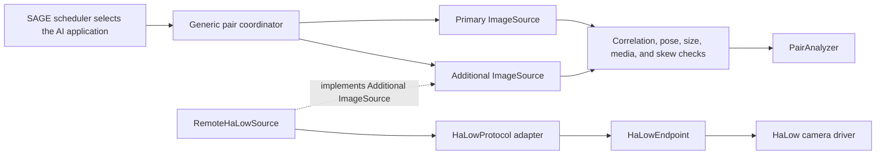

# Wi-Fi HaLow additional-camera orchestration

The HaLow camera is an optional additional viewpoint. It does not replace the
primary camera, change the scheduling score, or make HaLow a requirement for
existing workloads.

The small `pkg/orchestration` core coordinates a two-image inference only when
an application explicitly uses it:

## Core behavior

- The primary and additional sources receive one request ID and capture
  concurrently.
- Sessions on the same coordinator are serialized so two inferences cannot
  interleave access to the same physical cameras.
- Each image must contain the request ID, camera ID, capture time, capture-time
  camera pose, an `image/*` media type, and a bounded non-empty payload.
- The pair is rejected when capture timestamps exceed the configured maximum
  skew.
- The AI boundary is called only after both images are present and valid.
- Payloads are copied at component boundaries so camera or AI implementations
  cannot mutate orchestrator state.

Primary and additional images explicitly report whether their timestamps are
synchronized. The default coordinator rejects a pair when either timestamp is
not trustworthy. An operator may disable this requirement for best-effort
inference, in which case the skew check is skipped; receive time is not used as
a substitute because HaLow link latency can vary.

## Position and view metadata

The reviewed `Bowuzu/Sage-Halow-CC` prototype identifies a camera by a
MAC-derived node ID and timestamps its capture, but it does not report GPS
coordinates or PTZ state. The core therefore adds a generic `CameraPose` to
every `CameraFrame`, normalized `Image`, and HaLow image manifest:

- `GeoPosition` contains WGS84 latitude/longitude, optional altitude,
  horizontal accuracy, fix time, and the position source.
- A fixed camera may use `source: "surveyed"`; a mobile camera should use a
  current `"gps"` or `"network"` fix.
- `PTZState` records pan clockwise from true north, signed tilt, roll, zoom
  ratio, horizontal/vertical field of view, and the time the view was observed.
- Fixed cameras still report their calibrated constant view. PTZ cameras
  snapshot their feedback for each frame rather than reporting only a current
  device-wide state.

The default coordinator requires a pose and rejects invalid coordinates,
ambiguous orientation references, future metadata, or view feedback older than
five seconds. `RequireCameraPose` can be disabled only for a legacy source;
when pose data is present it is always validated. The hardware adapter remains
responsible for reading a GPS receiver or configured surveyed position,
calibrating true north, and reading actual PTZ feedback after motion settles.

## HaLow request/reply seam

`HaLowCaptureRequest` and `HaLowCaptureResponse` define the versioned
`halow.capture/v1` contract. `RemoteHaLowSource` is the THOR-side adapter and
`HaLowEndpoint` connects the request to the selected HaLow camera.

Wi-Fi HaLow is the network link, not the application protocol. `HaLowProtocol`
therefore remains transport-neutral, although MQTT over HaLow is the expected
first adapter. Keeping MQTT clients and board SDKs outside the scheduler core
also allows another remote-camera transport to implement `ImageSource`
directly.

## Verified large-image delivery

The core includes a compact transfer contract for constrained links:

- `HaLowImageManifest` carries the request ID, camera ID, trusted capture-time
  flag, capture-time camera pose, media type, total bytes, chunk count, and
  SHA-256.
- `HaLowImageChunk` repeats the request and camera identity on every chunk.
- `DefaultHaLowChunkBytes` is 8 KiB; payloads up to the 60 KiB
  `DefaultHaLowSingleMessageBytes` threshold may remain one transport message.
- `AssembleHaLowImage` accepts out-of-order chunks but rejects missing,
  duplicate, oversized, misidentified, corrupted, or incomplete JPEG data.
- `HaLowImageAck{persisted:true}` means the receiver verified and durably
  stored the complete image, so a store-and-forward camera may delete its
  cached copy.

The 60 KiB/8 KiB defaults and ACK-before-delete lifecycle are informed by the
field prototype in
[`Bowuzu/Sage-Halow-CC`](https://github.com/Bowuzu/Sage-Halow-CC), but this
implementation uses a new correlation-safe contract rather than copying its
unlicensed source.

A concrete MQTT adapter remains responsible for topic mapping, TLS and
authentication, bounded transfer timeouts, durable SD caching, retries after a
missing ACK, and publishing the ACK only after persistence.

## Integration boundary

The SAGE scheduling policy continues to admit and rank the complete AI
application. The selected application (for example Mortimus on THOR) wires:

1. its normal camera driver as the primary `ImageSource`;
2. HaLow, or any other extra camera, as the additional `ImageSource`;
3. its two-image model adapter as `PairAnalyzer`.

This repository does not yet contain the hardware-specific camera, GPS, or PTZ
driver or a concrete MQTT-over-HaLow adapter, so it does not contact a camera,
broker, or AI service by itself.
