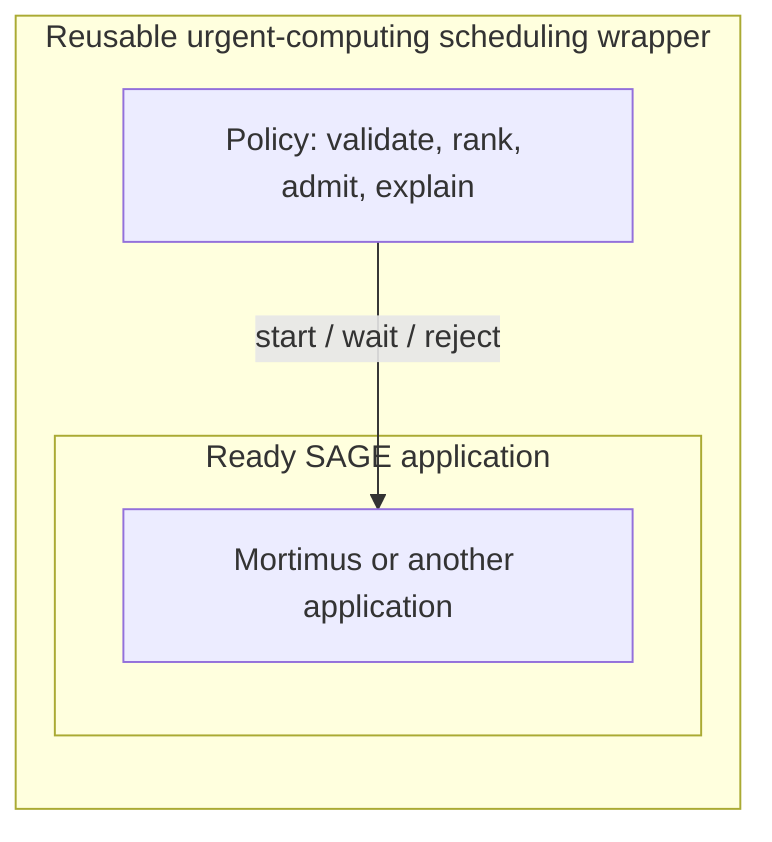
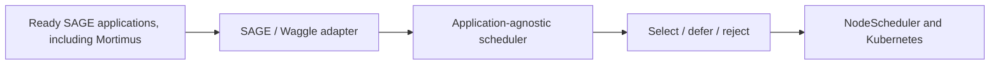

# Resilient Urgent Scheduling for SAGE

Urgent computing aims to produce a useful result before that result loses its
value. A correct decision delivered after its operational deadline can be as
unhelpful as a wrong decision.

This project adds an explainable scheduling layer for urgent edge applications.
It decides which ready application should start next, checks whether it can
start safely, and explains the decision. The decision engine is
application-agnostic; Mortimus is the concrete integration target used here to
explain and validate it.

The implementation is available in the
[scheduler source repository](https://github.com/NunesClement/sage-resilient-urgent-scheduler).

## The problem

SAGE nodes run multiple applications on limited edge hardware. Routine work and
time-sensitive events may compete for the same CPU, memory, GPU, and execution
slots while priorities and deadlines change.

Mortimus makes this problem concrete. Routine landscape observation may wait,
but a possible smoke event makes timely inference more valuable. The scheduler
must answer three questions:

1. Which ready application should start next?
2. Can it start without exceeding safe limits?
3. Why was each application selected, deferred, or rejected?

## Project goal: a reusable scheduling wrapper

The goal is not to build a scheduler that works only for Mortimus. It is to
provide a reusable urgent-computing wrapper around the scheduling boundary of a
SAGE application.



“Wrapper” is a conceptual boundary: it does not modify the application or wrap
its container. It surrounds the readiness-to-execution decision with a policy
that reads generic task metadata and decides whether the application may start.

The wrapper is designed to:

- favor deadline-sensitive work while using queue age to reduce starvation;
- enforce configured concurrency and trusted resource limits;
- return deterministic decisions with a reason for every candidate;
- continue with a bounded queue-order fallback if the main policy fails;
- remain reusable across applications and testable without a live cluster.

SAGE remains the platform orchestrator. The wrapper changes only the selection
policy inside its existing workflow; it does not replace Beehive, WES, the
`NodeScheduler`, or Kubernetes.

## How the wrapper fits into SAGE



The SAGE adapter converts ready and active Waggle runtimes into generic task
data. The scheduler returns explained decisions, the existing `NodeScheduler`
creates Pods, and Kubernetes places and runs them. Another controller can reuse
the decision engine through its own adapter.

## Mortimus integration target

Mortimus is a SAGE application for a field-vision scenario. Cameras observe a
remote landscape, inference runs close to the data, and the wider system can
publish a compact result instead of continuously moving full-resolution
imagery.

The two scenes illustrate the operational change that creates urgency:

| Routine landscape observation | Possible smoke event |
|---|---|
|  |  |

**In urgent computing, the right result delivered too late is the wrong result.**

*These are project-context images, not scheduler output or evaluation results.*

The scheduler does not detect smoke or choose an AI model. When SAGE makes the
Mortimus application ready, the generic policy can rank and admit it like any
other SAGE workload. The repository prepares this integration boundary, but it
does not contain an end-to-end Mortimus deployment.

The wider Mortimus concept connects the cameras, local inference on a SAGE
Thor node, the scheduler, a low-bandwidth Meshtastic path, and optional Beehive
publication:


*Conceptual system context. Solid lines represent physically linked components;
dotted lines represent distant request or image exchange.*

In this design, the scheduler remains the reusable selection layer. The
companion [SAGE Meshtastic project](https://github.com/dMac716/sage-dev-meshtastic)
explores the low-bandwidth control and verdict path rather than embedding that
transport in the scheduler.

The repository also includes an optional paired-camera core for a primary and
an additional HaLow image source. It correlates the captures and validates
time, pose, size, and transfer integrity before calling an injected analyzer.
This is an optional application feature, not a scheduler requirement. Camera
drivers, MQTT/Meshtastic adapters, storage, AI models, and Beehive publication
remain separate integration work.

## Concepts in more detail

| Term | Meaning in this project |
|---|---|
| **Intent** | The desired result, without prescribing how to obtain it. |
| **Policy** | The explicit rules used to rank ready applications and decide which may start. |
| **Admission** | The checks that enforce concurrency and trusted resource limits. |
| **Selected** | Valid work admitted to start now. |
| **Deferred** | Valid work that remains queued because it cannot start now. |
| **Rejected** | Invalid or ineligible work. |
| **Fail-open** | A bounded queue-order decision fallback used only when the main policy fails. |

The optional `intentctl` feature converts natural language into a small,
reviewable SAGE science-goal draft. It always requires human approval and does
not select plugins, assign priority, submit jobs, or bypass the policy.

Urgency is represented through deadline slack:

```text
slack = deadline - current time - estimated runtime
```

Negative slack means that an on-time finish is already unlikely. The wider
urgent-computing problem may also involve data movement, network conditions,
energy, cost, and result quality. The current policy is narrower: it uses
priority, slack, queue age, a provided success-probability estimate, and bounded
resource information.

## How the policy decides

1. **Observe and validate** ready and active tasks.
2. **Rank** valid tasks using priority, deadline slack, queue age, and provided
   success probability.
3. **Admit** tasks within total/GPU concurrency limits and, when trustworthy
   capacity exists, CPU/memory/GPU limits.
4. **Explain** every selection, deferral, or rejection with a stable reason.
5. **Degrade safely** to bounded FIFO if the engine fails and fail-open is
   enabled.

Fail-open preserves basic scheduling continuity. It is not retry, migration,
checkpoint recovery, or automatic model switching.

## Implemented components

| Component | Current role |
|---|---|
| Policy engine | Deterministic ranking, admission, and explained decisions. |
| SAGE/Waggle adapter and `waggle-nodescheduler` | Inject the policy into the existing SAGE scheduler. |
| `policyctl` | Validate configuration and replay queue snapshots offline. |
| `chaoslab` | Measure sensitivity to controlled input changes; it does not inject live failures. |
| `intentctl` | Produce a strict, human-reviewed SAGE science-goal draft. |

The included replay shows the intended behavior: an urgent `smoke-detector`
with negative slack is selected, while a routine `image-sampler` is deferred by
the concurrency limit and remains eligible to run later.

## Current status and next validation

The scheduler is tested offline and the SAGE integration is prepared, but it
has not been deployed on a SAGE node. Resource fitting remains off by default
until SAGE supplies trustworthy capacity data, and upstream queue identity and
snapshot issues must be resolved before a canary.

The validation direction is replay, KWOK or k3s integration, SAGE shadow mode,
and then a controlled Mortimus canary.

## Learn more

- [Embedded source snapshot](orchestrator/)
- [Detailed architecture](orchestrator/docs/architecture.md)
- [SAGE integration status](orchestrator/docs/sage-integration.md)
- [Intent translation](orchestrator/docs/intent-translation.md)
- [Urgent-versus-routine replay](orchestrator/examples/snapshots/urgent-vs-routine.json)
