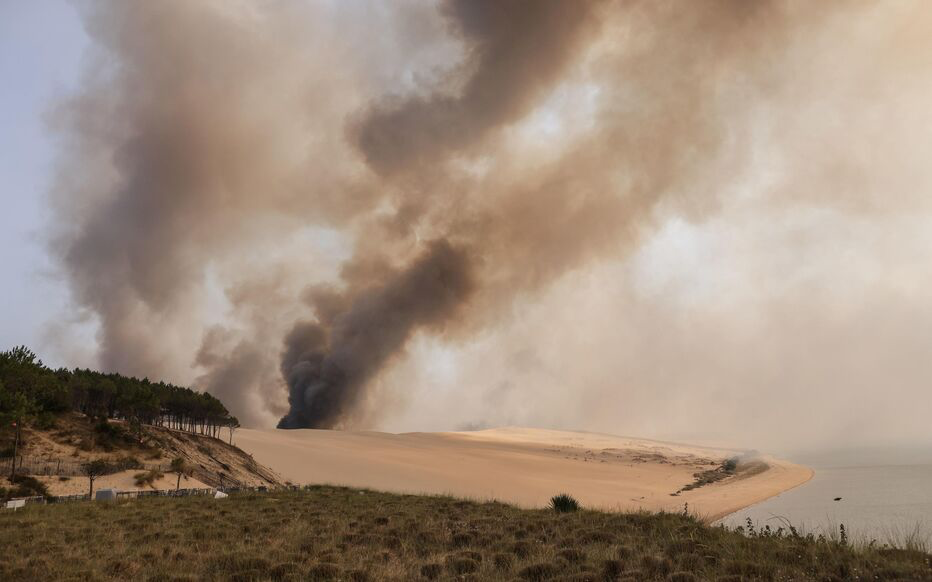
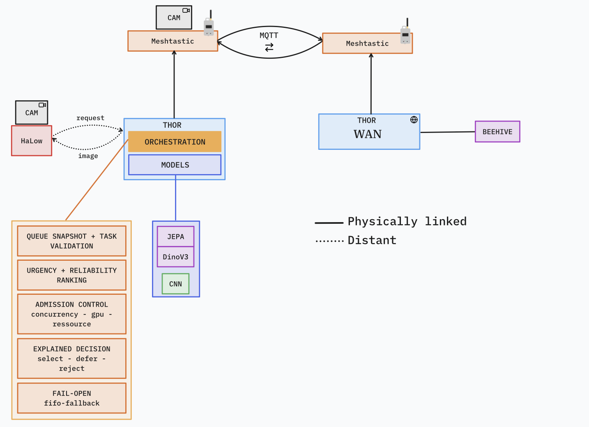
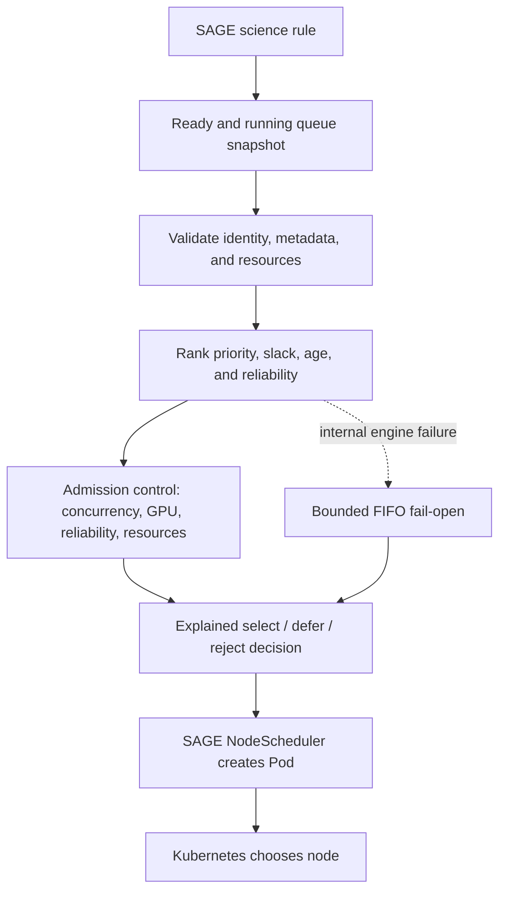
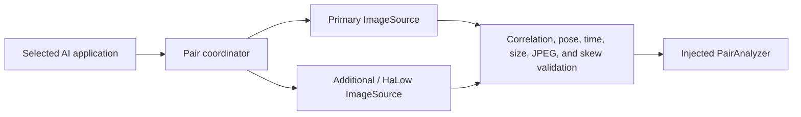

# Resilient Urgent SAGE Orchestration — First-Pass Summary

**Project:** Build an explainable admission and scheduling layer for urgent
edge-AI applications on SAGE/Waggle nodes. The scheduler should favor
time-sensitive work without permanently starving routine tasks, respect
concurrency and GPU limits, and explain every selection, deferral, or
rejection. An optional second component establishes a validated
primary/additional-camera boundary for multi-view AI applications.

The complete implementation and technical documentation are included in
[`orchestrator/`](orchestrator/).

## Challenge

SAGE nodes run several science applications on constrained edge hardware.
Routine collection, urgent event detection, GPU workloads, and unreliable
application metadata may all compete for the same node. A useful policy needs
to answer three questions deterministically:

1. Which ready application is most urgent and valuable to run now?
2. Does the node have a safe admission slot for it?
3. Why was every candidate selected, deferred, or rejected?

The policy deliberately stops at admission. The existing SAGE
`NodeScheduler` creates the Pod, and Kubernetes performs final node placement.

## Motivating context: Mortimus and resilient field vision

The orchestrator was developed in the context of a broader Mortimus /
SmokeSpotter field concept: cameras observe a remote landscape, AI runs beside
the image on a SAGE Thor node, and the system sends a small decision instead of
streaming full-resolution imagery over a constrained link. A normal scene is
routine work; the appearance of a smoke plume turns capture, inference, and
corroboration into deadline-sensitive work.

The two scenes below illustrate that operational contrast. They are project
context images, not model outputs or a reported evaluation dataset.

| Clear reference scene | Smoke event |
|---|---|
|  |  |

The larger concept combines a primary camera, an additional HaLow camera,
local model execution, resilient scheduling, a low-bandwidth Meshtastic
control path, and optional WAN publication:



*Conceptual system context. Solid lines represent physically linked
components; dotted lines represent distant request/image exchange.*

This repository implements the orange scheduling brain and the optional
paired-camera/HaLow coordination contracts. The diagram's concrete Mortimus
application, JEPA/DINO/CNN model cascade, MQTT and Meshtastic adapters, and
Beehive publication path remain separate integration work. The companion
[Sage Meshtastic project](https://github.com/dMac716/sage-dev-meshtastic)
explores the low-bandwidth control and verdict path.

## Inputs and policy

Each queue snapshot contains ready tasks, running tasks, the decision time,
and optional available capacity. A task may declare:

- identity and enqueue time;
- priority from 0 to 100;
- estimated runtime and deadline or maximum queue latency;
- predicted probability of success;
- CPU, memory, and GPU requirements.

For every valid ready task:

```text
deadline = explicit deadline
        or enqueue time + maximum queue latency

slack = deadline - decision time - estimated runtime
```

The example policy combines four normalized scores:

| Signal | Weight | Purpose |
|---|---:|---|
| Priority | 45% | Represents operator or science importance |
| Deadline slack | 30% | Raises work that is close to missing its deadline |
| Queue age | 15% | Reduces permanent starvation of older work |
| Reliability | 10% | Favors work expected to complete successfully |

Admission then checks global concurrency, GPU concurrency, the minimum
reliability threshold, and optionally CPU/memory/GPU capacity.
Workload-provided environment hints are ignored by default because they are
self-declared rather than attested control-plane data.

## Implemented architecture



The paired-camera library is additive and independent of scheduling:



It generates one request identity, captures both viewpoints concurrently,
serializes access to the physical pair, validates capture-time position and
PTZ state, and defensively copies image data at component boundaries. The
HaLow transfer contract adds chunk identity, SHA-256 verification, and an
acknowledgement that permits cached-image deletion only after durable
persistence.

## Current result

The supplied offline scenario compares an urgent GPU smoke detector with a
routine CPU image sampler at the same queue age:

| Candidate | Priority | Slack | Score | Decision |
|---|---:|---:|---:|---|
| `smoke-detector` | 90 | -5 s | 80.75 | Selected |
| `image-sampler` | 20 | 540 s | 19.65 | Deferred: concurrency limit |

The urgent task is selected because it has both high priority and no remaining
deadline slack. The routine task remains valid and can age into a stronger
future position; it is not rejected.

The repository includes:

- a pure Go policy engine with strict, versioned YAML configuration;
- `policyctl` for offline snapshot replay and explained JSON decisions;
- `chaoslab` for deterministic sensitivity analysis;
- a SAGE/Waggle adapter and replacement `sage-nodescheduler` binary;
- example Docker and Kubernetes deployment material;
- an optional paired-camera/HaLow contract;
- 92 named tests and one fuzz target across policy, adapter, CLI, resource,
  orchestration, transfer, and configuration behavior.

## What the result means

The project currently demonstrates a scheduling brain and integration
boundary, not a production deployment. In particular:

- `failOpen` means bounded FIFO scheduling after a policy-engine failure; it
  does not mean switching from one AI model to another;
- predicted reliability is a configured or declared value, not a learned
  measurement from inference telemetry;
- real resource fitting remains disabled because the pinned Waggle revision
  supplies placeholder availability;
- the camera component defines interfaces and validation behavior but has no
  concrete camera, GPS/PTZ, MQTT, durable-storage, or AI adapter;
- no SAGE node has yet run this replacement scheduler.

## Caveats

The largest blockers are in the pinned upstream Waggle controller:

- some queue removal paths identify work by plugin name rather than full
  runtime identity;
- the ready queue cannot be snapshotted atomically;
- the local scheduling REST route creates incomplete runtime objects;
- Pod-creation failures are not always requeued;
- queue age is held only in memory and resets after restart.

The policy interface also cannot preempt a running Pod, checkpoint work,
create replicas, migrate tasks, or manage retry budgets.

## Next

1. Confirm the exact Waggle image/commit, k3s version, node architectures,
   namespace, service account, and deployment method with the SAGE team.
2. Fix full-identity queue removal, atomic snapshots, and requeue behavior
   upstream.
3. Run the full test and race-test matrix with Go 1.20 and the current
   supported toolchain.
4. Validate in offline replay and shadow mode before a controlled canary.
5. If paired-camera inference is pursued, implement the hardware,
   MQTT-over-Wi-Fi-HaLow, durable caching, and `PairAnalyzer` adapters as
   separate deployment components.
