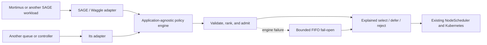
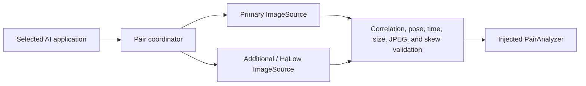

# Resilient Scheduling for SAGE — Mortimus Integration

**Direction:** Build one explainable scheduling core, connect it to SAGE through
an adapter, and validate it first with Mortimus. The scheduler favors urgent
work without permanently starving routine tasks, respects concurrency and GPU
limits, and explains every selection, deferral, or rejection.

The scheduler is developed in the
[canonical GitHub repository](https://github.com/NunesClement/sage-resilient-urgent-scheduler).
A source snapshot and the technical documentation are included in
[`orchestrator/`](orchestrator/).

## Reusable core, Mortimus first

The policy engine is application-agnostic: it sees task identity, priority,
deadlines, age, reliability, and resource needs—not cameras, smoke, Mortimus,
or a specific AI model. The SAGE adapter translates Waggle queues into this
generic input and returns the selected tasks to the existing `NodeScheduler`.

Mortimus is the first target integration because smoke detection makes urgency
and limited edge capacity concrete. The same engine can be reused for another
SAGE application or plugged into a different queue/controller by implementing
an adapter at the boundary; application-specific capture, inference, and
communication remain outside the scheduler.

## Challenge

SAGE nodes run several science applications on constrained edge hardware.
Routine collection, urgent event detection, GPU workloads, and unreliable
application metadata may all compete for the same node. A useful policy needs
to answer three questions deterministically:

1. Which ready application is most urgent and valuable to run now?
2. Does the node have a safe admission slot for it?
3. Why was every candidate selected, deferred, or rejected?

The policy deliberately stops at admission. The existing SAGE
`NodeScheduler` creates the Pod, and Kubernetes performs final node placement.

## Mortimus validation context

In the Mortimus / SmokeSpotter field concept, cameras observe a remote
landscape, AI runs beside the image on a SAGE Thor node, and the system sends a
small decision instead of streaming full-resolution imagery over a constrained
link. A normal scene is routine work; a possible smoke plume makes capture,
inference, and corroboration deadline-sensitive.

The two scenes below illustrate that operational contrast. They are project
context images, not model outputs or a reported evaluation dataset.

| Clear reference scene | Smoke event |
|---|---|
|  |  |

The larger concept combines local inference, resilient scheduling, an optional
additional HaLow camera, a low-bandwidth Meshtastic path, and WAN publication:


*Conceptual system context. Solid lines represent physically linked
components; dotted lines represent distant request/image exchange.*

This project supplies the reusable scheduling brain and optional
paired-camera/HaLow contracts. Mortimus inference, camera drivers, MQTT and
Meshtastic adapters, and Beehive publication remain integration work. The
companion
[Sage Meshtastic project](https://github.com/dMac716/sage-dev-meshtastic)
explores the low-bandwidth control and verdict path.

## Inputs and policy

Each queue snapshot contains ready tasks, running tasks, the decision time,
and optional available capacity. A task may declare:

- identity and enqueue time;
- priority from 0 to 100;
- estimated runtime and deadline or maximum queue latency;
- predicted probability of success;
- CPU, memory, and GPU requirements.

For every valid ready task:

```text
deadline = explicit deadline
        or enqueue time + maximum queue latency

slack = deadline - decision time - estimated runtime
```

The example policy combines four normalized scores:

| Signal | Weight | Purpose |
|---|---:|---|
| Priority | 45% | Represents operator or science importance |
| Deadline slack | 30% | Raises work that is close to missing its deadline |
| Queue age | 15% | Reduces permanent starvation of older work |
| Reliability | 10% | Favors work expected to complete successfully |

Admission then checks global concurrency, GPU concurrency, the minimum
reliability threshold, and optionally CPU/memory/GPU capacity.
Workload-provided environment hints are ignored by default because they are
self-declared rather than attested control-plane data.

## Implemented architecture



The paired-camera library is additive and independent of scheduling:



It generates one request identity, captures both viewpoints concurrently,
serializes access to the physical pair, validates capture-time position and
PTZ state, and defensively copies image data at component boundaries. The
HaLow transfer contract adds chunk identity, SHA-256 verification, and an
acknowledgement that permits cached-image deletion only after durable
persistence.

An optional intent gateway is also additive. `intentctl` asks the existing
Hermes/GLM service to translate natural language into a small SAGE science-goal
draft. The draft is validated and always requires human review; it cannot
choose plugins, assign scheduler priority, or submit a job.

## Current result

The supplied offline scenario compares an urgent GPU smoke detector with a
routine CPU image sampler at the same queue age:

| Candidate | Priority | Slack | Score | Decision |
|---|---:|---:|---:|---|
| `smoke-detector` | 90 | -5 s | 80.75 | Selected |
| `image-sampler` | 20 | 540 s | 19.65 | Deferred: concurrency limit |

The urgent task is selected because it has both high priority and no remaining
deadline slack. The routine task remains valid and can age into a stronger
future position; it is not rejected.

The repository includes:

- a pure Go policy engine with strict, versioned YAML configuration;
- `policyctl` for offline snapshot replay and explained JSON decisions;
- `chaoslab` for deterministic sensitivity analysis;
- a SAGE/Waggle adapter and replacement `sage-nodescheduler` binary;
- `intentctl` for human-reviewed natural-language science-goal drafts;
- example Docker and Kubernetes deployment material;
- an optional paired-camera/HaLow contract;
- unit tests and a fuzz target across policy, adapter, CLI, intent,
  orchestration, transfer, and configuration behavior.

## Artifacts of accomplishments

- [Canonical scheduler repository](https://github.com/NunesClement/sage-resilient-urgent-scheduler)
- [Project explanation PDF](orchestrator/output/pdf/sage-resilient-urgent-scheduler-explanation.pdf)
- [Repository guide PDF](orchestrator/output/pdf/sage-resilient-urgent-scheduler-repository-guide.pdf)
- [Complete scheduler and paired-camera source](orchestrator/)
- [Intent-translation experiment](orchestrator/docs/intent-translation.md)
- [Offline urgent-versus-routine example](orchestrator/examples/snapshots/urgent-vs-routine.json)
- [Chaos sensitivity experiment](orchestrator/examples/chaos/sensitivity.json)
- [Classroom notes and workshop tutorial](classroom-notes.md)

## Current boundaries

This is a tested scheduling core and integration boundary, not a production
deployment:

- `failOpen` means bounded FIFO scheduling after a policy-engine failure; it
  does not mean switching from one AI model to another;
- resource fitting remains disabled until SAGE supplies trustworthy capacity;
- camera, GPS/PTZ, MQTT, storage, and AI adapters remain separate from the
  scheduler core;
- intent output is a reviewable draft, never an executable scheduling command;
- upstream queue identity, atomic snapshot, requeue, and restart-state issues
  must be addressed before a canary;
- preemption, checkpointing, replication, migration, and retry budgets remain
  outside the current SAGE policy interface.

## Next

1. Confirm the exact Waggle image/commit, k3s version, node architectures,
   namespace, service account, and deployment method with the SAGE team.
2. Fix full-identity queue removal, atomic snapshots, and requeue behavior
   upstream.
3. Validate the generic policy in replay and shadow mode, then run it alongside
   the Mortimus workload in a controlled canary.
4. If paired-camera inference is pursued, implement the hardware,
   MQTT-over-Wi-Fi-HaLow, durable caching, and `PairAnalyzer` adapters as
   separate deployment components.
